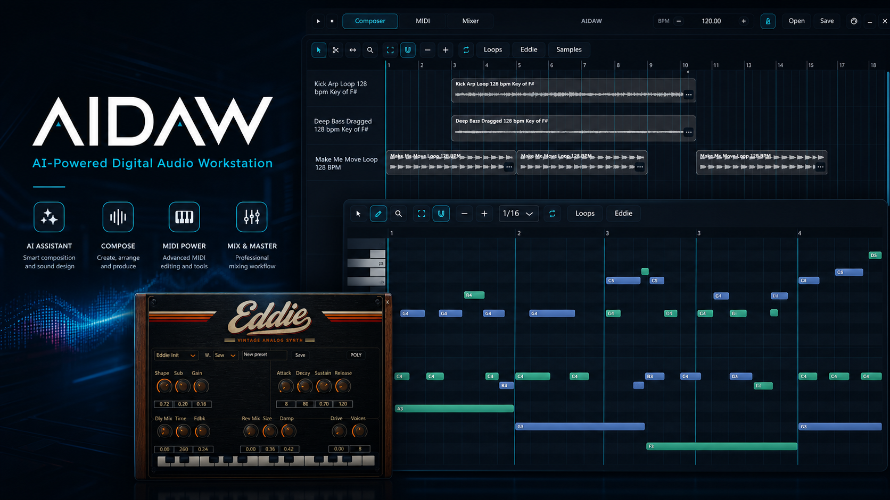
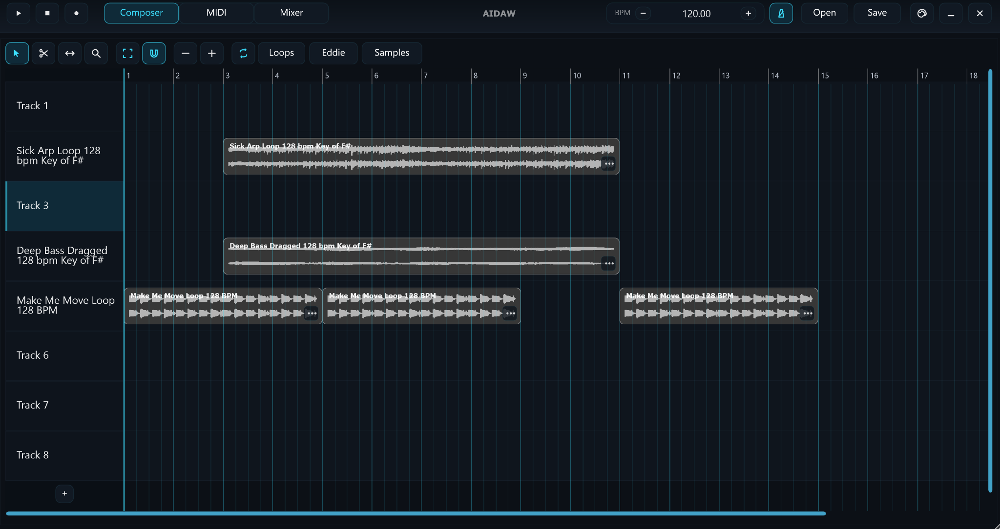
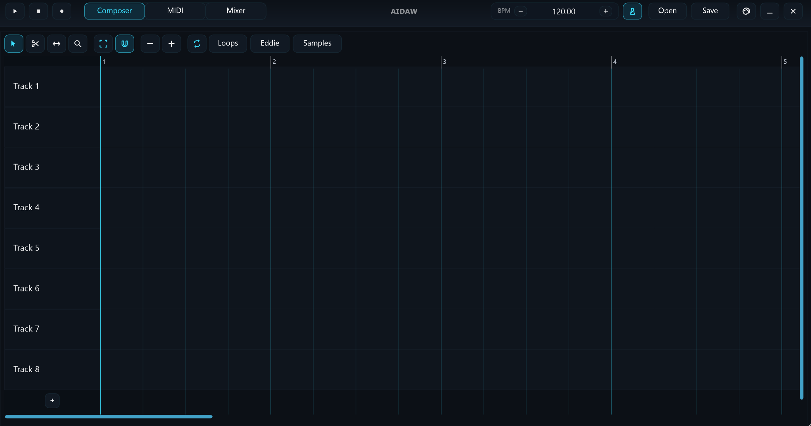
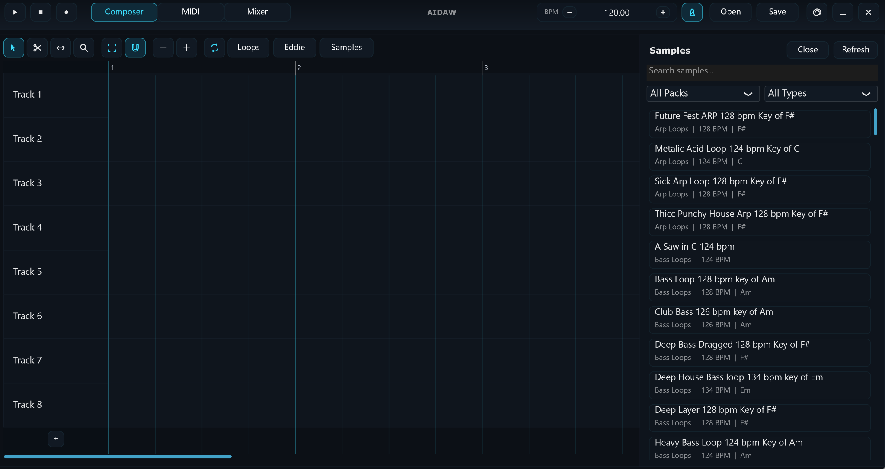
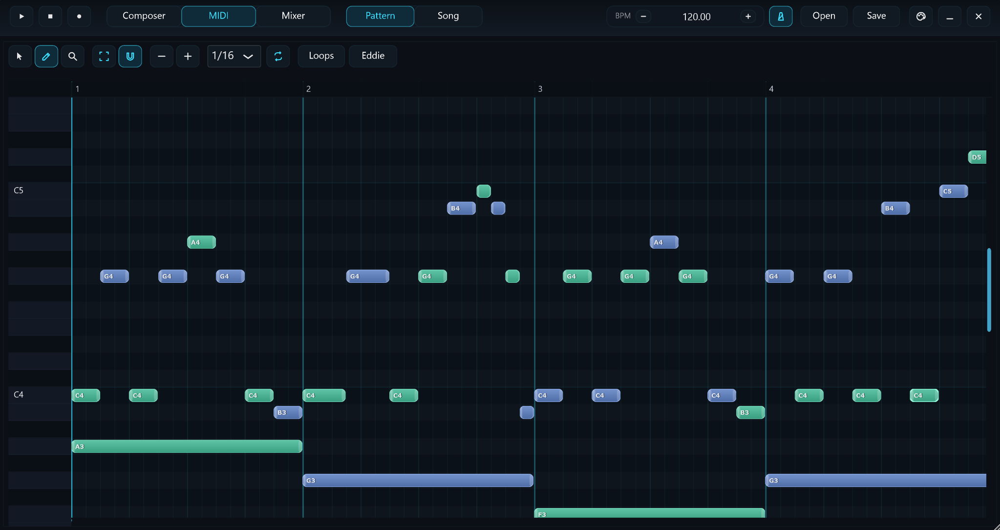

# AIDAW

AIDAW is a JUCE/CMake desktop music app prototype. It combines a composer timeline, MIDI loop editor, sample browser, metronome, audio-file clips, and an integrated synth named Eddie.



## Screenshots

### Composer and Audio Clips







### MIDI and Eddie Synth




## Current Features

- Composer timeline with tracks, clip movement/resizing, slicing, snapping, zooming, playhead control, and vertical lane zoom
- Drag-and-drop audio clips into the arranger with waveform thumbnails and cached thumbnail loading
- Audio clip controls inspired by FL Studio: stretch/resample mode, source BPM, timeline length, gain, normalize, mute, rename, delete, and pitch controls
- Pitch-safe audio clip defaults: dragged samples use stretch mode by default so tempo changes and clip resizing do not automatically change pitch
- Built-in sample browser for local/free sample packs, with themed filtering, click-to-preview, sample-rate-correct preview playback, and drag-to-arranger support
- MIDI loop creation, editing, looping, and reuse in the composer
- Eddie synth playback for MIDI loops, with waveform and sound controls
- Project save/open support using `.aidaw` XML project files
- Transport controls for play, stop, record-arm state, tempo, click, and song/pattern playback
- Theme and thumbnail cache support through JUCE application properties

The mixer screen is currently a placeholder.

## Repository Layout

```text
.
+-- apps/AIDAW/
|   +-- Assets/          # App assets embedded through JUCE BinaryData
|   +-- Source/
|       +-- app/         # Main window and top-level app component
|       +-- audio/       # Metronome, timeline audio source, Eddie synth
|       +-- ui/          # Arranger, MIDI editor, mixer, shell, shared UI
+-- photos/              # README screenshots
+-- Samples/             # Local sample packs scanned by the sample browser
+-- third_party/juce/    # JUCE submodule
+-- CMakeLists.txt       # Root CMake project
+-- LICENSE
```

## Requirements

- CMake 3.22 or newer
- A C++20 compiler
- Git with submodule support
- Platform build tools:
  - Windows: Visual Studio 2022 with C++ desktop workload
  - macOS: Xcode command line tools
  - Linux: a supported compiler plus JUCE's Linux system dependencies

JUCE is included as a Git submodule at `third_party/juce`.

## Getting Started

Clone with submodules:

```powershell
git clone --recurse-submodules <repo-url>
cd AIDAW
```

If the repo was already cloned without submodules:

```powershell
git submodule update --init --recursive
```

Configure and build:

```powershell
cmake -S . -B build
cmake --build build --config Release
```

Run the Windows Release build:

```powershell
.\build\AIDAW_artefacts\Release\AIDAW.exe
```

For a Debug build:

```powershell
cmake --build build --config Debug
.\build\AIDAW_artefacts\Debug\AIDAW.exe
```

## Development Notes

- The project uses `juce_add_gui_app` and `juce_generate_juce_header` from JUCE's CMake API.
- App sources are explicitly listed in the root `CMakeLists.txt`; add new `.cpp` files there when creating new source files.
- Embedded assets are defined in the `AIDAWAssets` binary data target.
- Sample packs are scanned from `Samples/`, from a sibling `Samples/` folder beside the built app, and from `Documents/AIDAW/Samples` or the user's app data folder. This keeps the local pack model compatible with future downloaded marketplace packs.
- Build outputs are ignored under `build/` and should not be committed.
- Project files saved from the app use the `.aidaw` extension.

## License

This repository is licensed under the terms in `LICENSE`.
